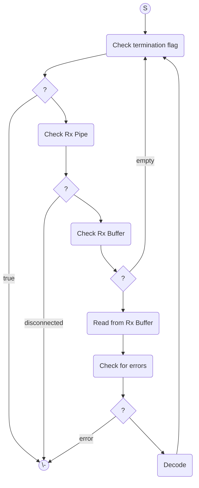
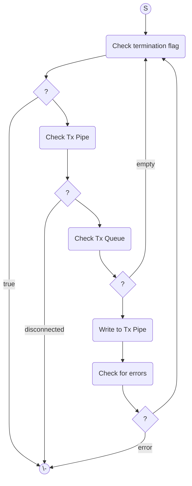

# P2P_Endpoint Activities
## Rx Thread

```mermaid
graph TB
    s((S)) --> a0(Check termination flag)
    a0 --> c0{?}
    c0 --true--> e((\-))
    c0 --> a1(Check Rx Pipe)
    a1 --> c1{?}
    c1 -- disconnected --> e
    c1 --> a2(Check Rx Buffer)
    a2 --> c2{?}
    c2 -- empty --> a0
    c2 --> a3(Read from Rx Buffer)
    a3 --> a4(Check for errors)
    a4 --> c3{?}
    c3 -- error --> e
    c3 --> a5(Decode)
    a5 --> a0
```

## Tx Thread

```mermaid
graph TB
    s((S)) --> a0(Check termination flag)
    a0 --> c0{?}
    c0 --true--> e((\-))
    c0 --> a1(Check Tx Pipe)
    a1 --> c1{?}
    c1 -- disconnected --> e
    c1 --> a2(Check Tx Queue)
    a2 --> c2{?}
    c2 -- empty --> a0
    c2 --> a3(Write to Tx Pipe)
    a3 --> a4(Check for errors)
    a4 --> c3{?}
    c3 -- error --> e
    c3 --> a0
```
